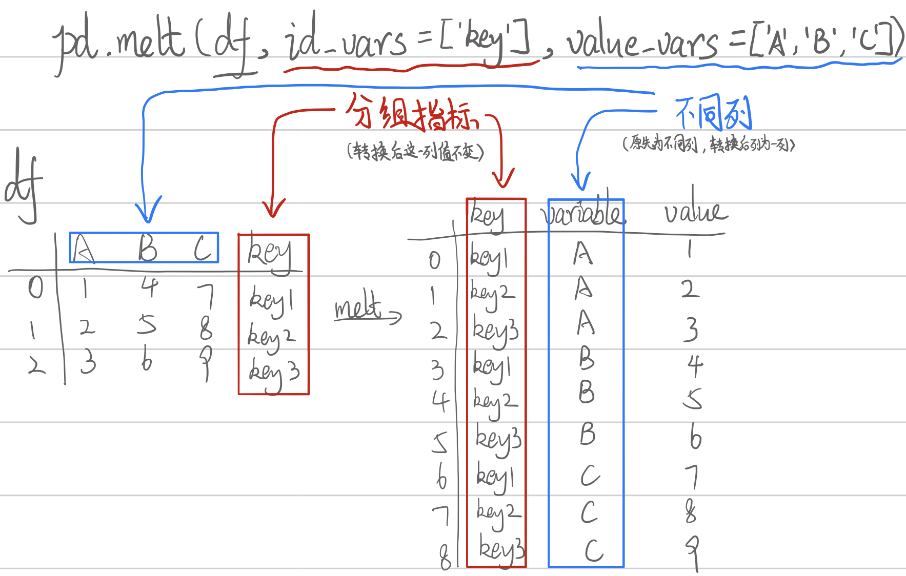
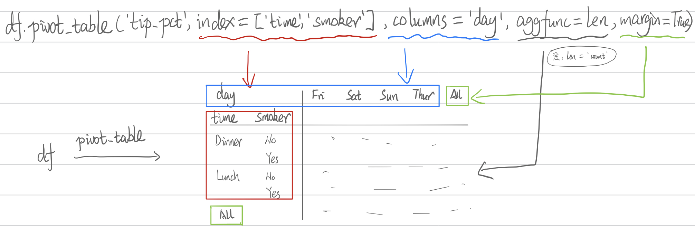
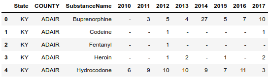
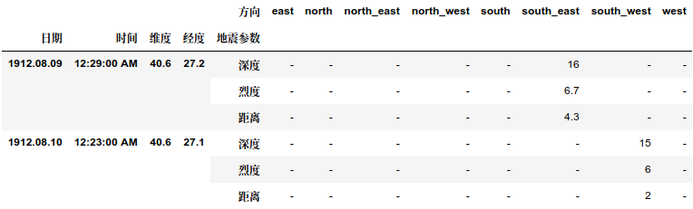

# 第四章 变形

## 一、重难点总结

示例用到的数据（仅显示以学校分组后每组的前五行）

|      | School | Class |   ID | Gender |  Address | Height | Weight | Math | Physics |
| ---: | -----: | ----: | ---: | -----: | -------: | -----: | -----: | ---: | ------: |
|    0 |    S_1 |   C_1 | 1101 |      M | street_1 |    173 |     63 | 34.0 |      A+ |
|    1 |    S_1 |   C_1 | 1102 |      F | street_2 |    192 |     73 | 32.5 |      B+ |
|    2 |    S_1 |   C_1 | 1103 |      M | street_2 |    186 |     82 | 87.2 |      B+ |
|    3 |    S_1 |   C_1 | 1104 |      F | street_2 |    167 |     81 | 80.4 |      B- |
|    4 |    S_1 |   C_1 | 1105 |      F | street_4 |    159 |     64 | 84.8 |      B+ |
|   15 |    S_2 |   C_1 | 2101 |      M | street_7 |    174 |     84 | 83.3 |       C |
|   16 |    S_2 |   C_1 | 2102 |      F | street_6 |    161 |     61 | 50.6 |      B+ |
|   17 |    S_2 |   C_1 | 2103 |      M | street_4 |    157 |     61 | 52.5 |      B- |
|   18 |    S_2 |   C_1 | 2104 |      F | street_5 |    159 |     97 | 72.2 |      B+ |
|   19 |    S_2 |   C_1 | 2105 |      M | street_4 |    170 |     81 | 34.2 |       A |

### 1. 数据变形常用函数

| 操作            | 函数                      | 重要参数                                                     | 备注                                           | 举例                                                         |
| --------------- | ------------------------- | ------------------------------------------------------------ | ---------------------------------------------- | ------------------------------------------------------------ |
| 长格式 ➔ 宽格式 | `DataFrame.unstack()`     | `level`: Level(s) of index to unstack, can pass level name.<br />`fill_vallue`: Replace NaN with this value if the unstack produces missing values. |                                                | `df_stacked.unstack()`                                       |
|                 | `DataFrame.pivot()`       | `index`: Column to use to make new frame’s index. If None, uses existing index.<br />`columns`: Column to use to make new frame’s columns.<br />`values`: Column(s) to use for populating new frame’s values. If not specified, all remaining columns will be used and the result will have hierarchically indexed columns. | 行索引不允许出现重复值                         | `df.pivot(index='ID',columns='Gender',values='Height')`      |
|                 | `DataFrame.pivot_table()` | `values`: column to aggregate, optional<br />`index`: Keys (column) to group by on the pivot table index.<br />`columns`: Keys (column) to group by on the pivot table column.<br />`aggfunc`: function, list of functions, dict, default numpy.mean. If list of functions passed, the resulting pivot table will have hierarchical columns whose top level are the function names (inferred from the function objects themselves) If dict is passed, the key is column to aggregate and value is function or list of functions.<br />`fill_value`: Value to replace missing values with.<br />`margins`: Add all row / columns (e.g. for subtotal / grand totals).<br />`dropna`: Do not include columns whose entries are all NaN.<br />`margins_name`: Name of the row / column that will contain the totals when margins is True.<br />`observed`: This only applies if any of the groupers are Categoricals. If True: only show observed values for categorical groupers. If False: show all values for categorical groupers. |                                                | `df.pivot_table(values='Height', index=['School', 'Address'], columns='Gender', aggfunc=len, margins=True)`<br />`pd.pivot_table(df,index='School',columns='Gender',values='Height',aggfunc=['mean','sum']).head()` |
| 宽格式 ➔ 长格式 | `DataFrame.stack()`       | `level`: Level(s) of index to unstack, can pass level name.<br />`dropna`: Whether to drop rows in the resulting Frame/Series with missing values. Stacking a column level onto the index axis can create combinations of index and column values that are missing from the original dataframe. |                                                | `df_s.stack(level=0)`                                        |
|                 | `DataFrame.melt()`        | `id_vars`: Column(s) to use as identifier variables.<br />`value_vars`: Column(s) to unpivot. If not specified, uses all columns that are not set as id_vars.<br />`var_name`: Name to use for the ‘variable’ column. If None it uses `frame.columns.name` or ‘variable’.<br />`value_name`: Name to use for the ‘value’ column.<br />`col_level`: If columns are a MultiIndex then use this level to melt. |                                                | `pivoted.reset_index().melt(id_vars=['ID'],value_vars=['F','M'],value_name='Math').dropna().set_index('ID').sort_index()` |
|                 | `pd.crosstab()`           | `index`: Values to group by in the rows.<br />`columns`: Values to group by in the columns.<br />`values`: Array of values to aggregate according to the factors. Requires aggfunc be specified.<br />`aggfunc`: If specified, requires values be specified as well.<br />`margins`: Add row/column margins (subtotals).<br />`margins_name`: Name of the row/column that will contain the totals when margins is True.<br />`dropna`: Do not include columns whose entries are all NaN.<br />`rownames`: If passed, must match number of row arrays passed.<br />`colnames`: If passed, must match number of column arrays passed.<br />`normalize`: Normalize by dividing all values by the sum of values. | 交叉表是一种特殊的透视表，典型的用途如分组统计 | `pd.crosstab(index=df['Address'],columns=df['Gender'])`      |






## 二、问题与练习

### 1. 问题

#### 【问题一】 上面提到了许多变形函数，如melt/crosstab/pivot/pivot_table/stack/unstack函数，请总结它们各自的使用特点。

见上表。

#### 【问题二】 变形函数和多级索引是什么关系？哪些变形函数会使得索引维数变化？具体如何变化？

变形函数的使用可能产生多层索引。`pivot_table`在对`index`参数传入列表时，将会产生多层索引；`stack`和`unstack`多层索引输出取决输入数据框的形式；`crosstab`和`pivot`不支持多层索引。

#### 【问题三】 请举出一个除了上文提过的关于哑变量方法的例子。

```python
> df = pd.DataFrame({'Type':['A', 'A', 'A', 'B', 'B'], 'Size':[1, 1, 2, 2, 3]}, index=[1, 2, 3, 4, 5])
> pd.get_dummies(df['Type'])
	A	B
1	1	0
2	1	0
3	1	0
4	0	1
5	0	1
```

#### 【问题四】 使用完stack后立即使用unstack一定能保证变化结果与原始表完全一致吗？

不一定，取决于`unstack`参数中是否对缺失值进行填充，也取决于`stack`参数中是否选择保留缺失值。

#### 【问题五】 透视表中涉及了三个函数，请分别使用它们完成相同的目标（任务自定）并比较哪个速度最快。

个人感觉三者速度不能直接比较，因为计算的任务并不相同。例如，pivot只是简单变形，而pivot_table在变形的基础上默认计算了均值，二者任务不同，速度本身就不可比。

#### 【问题六】 既然melt起到了stack的功能，为什么再设计stack函数？

`stack`适合简单的透视操作，而`melt`功能更丰富，适合更加复杂的操作。

### 2. 练习

#### 【练习一】 继续使用上一章的药物数据集

```python
> df_ex1 = pd.read_csv('data/Drugs.csv')
> df_ex1
	YYYY	State	COUNTY	SubstanceName	DrugReports
0	2010	VA	ACCOMACK	Propoxyphene	1
1	2010	OH	ADAMS	Morphine	9
2	2010	PA	ADAMS	Methadone	2
3	2010	VA	ALEXANDRIA CITY	Heroin	5
4	2010	PA	ALLEGHENY	Hydromorphone	5
...	...	...	...	...	...
24057	2017	VA	WYTHE	Codeine	1
24058	2017	VA	WYTHE	Hydrocodone	19
24059	2017	VA	WYTHE	Tramadol	5
24060	2017	PA	YORK	ANPP	1
24061	2017	VA	YORK	Heroin	48
24062 rows × 5 columns
```

##### (a) 现在请你将数据表转化成如下形态，每行需要显示每种药物在每个地区的10年至17年的变化情况，且前三列需要排序

```python
> df_ex1_a_1 = df_ex1.pivot_table('DrugReports', index=['State', 'COUNTY', 'SubstanceName'], columns='YYYY', fill_value='-').reset_index()
> df_ex1_a_2 = df_ex1_a_1.sort_values(by=['State', 'COUNTY', 'SubstanceName'])
> df_ex1_a_2.columns.name = None
> df_ex1_a_2
	State	COUNTY	SubstanceName	2010	2011	2012	2013	2014	2015	2016	2017
0	KY	ADAIR	Buprenorphine	-	3	5	4	27	5	7	10
1	KY	ADAIR	Codeine	-	-	1	-	-	-	-	1
2	KY	ADAIR	Fentanyl	-	-	1	-	-	-	-	-
3	KY	ADAIR	Heroin	-	-	1	2	-	1	-	2
4	KY	ADAIR	Hydrocodone	6	9	10	10	9	7	11	3
...	...	...	...	...	...	...	...	...	...	...	...
6209	WV	WOOD	Oxycodone	6	4	24	7	7	11	7	1
6210	WV	WOOD	Tramadol	-	-	-	-	1	-	4	3
6211	WV	WYOMING	Buprenorphine	-	1	1	1	-	-	-	1
6212	WV	WYOMING	Hydrocodone	1	5	-	-	1	-	1	-
6213	WV	WYOMING	Oxycodone	5	4	14	12	5	-	-	-
6214 rows × 11 columns
```

##### (b) 现在请将(a)中的结果恢复到原数据表，并通过equal函数检验初始表与新的结果是否一致（返回True）

```python
> df_ex1_b_1 = pd.melt(df_ex1_a_2, id_vars=['State', 'COUNTY', 'SubstanceName'], value_vars=[2010, 2011, 2012, 2013, 2014, 2015, 2016, 2017])
> df_ex1_b_2 = df_ex1_b_1.loc[df_ex1_b_1['value'] != '-', ['YYYY', 'State', 'COUNTY', 'SubstanceName', 'value']].rename(columns={'value':'DrugReports'}).reset_index(drop=True)
> df_ex1_b_2
	YYYY	State	COUNTY	SubstanceName	DrugReports
0	2010	KY	ADAIR	Hydrocodone	6
1	2010	KY	ADAIR	Methadone	1
2	2010	KY	ALLEN	Hydrocodone	10
3	2010	KY	ALLEN	Methadone	4
4	2010	KY	ALLEN	Oxycodone	15
...	...	...	...	...	...
24057	2017	WV	WOOD	Hydrocodone	8
24058	2017	WV	WOOD	Isobutyryl fentanyl	3
24059	2017	WV	WOOD	Oxycodone	1
24060	2017	WV	WOOD	Tramadol	3
24061	2017	WV	WYOMING	Buprenorphine	1
24062 rows × 5 columns
```

#### 【练习二】 现有一份关于某地区地震情况的数据集，请解决如下问题：

```python
> df_ex2 = pd.read_csv('data/Earthquake.csv')
> df_ex2
	日期	时间	维度	经度	方向	距离	深度	烈度
0	2003.05.20	12:17:44 AM	39.04	40.38	west	0.1	10.0	0.0
1	2007.08.01	12:03:08 AM	40.79	30.09	west	0.1	5.2	4.0
2	1978.05.07	12:41:37 AM	38.58	27.61	south_west	0.1	0.0	0.0
3	1997.03.22	12:31:45 AM	39.47	36.44	south_west	0.1	10.0	0.0
4	2000.04.02	12:57:38 AM	40.80	30.24	south_west	0.1	7.0	0.0
...	...	...	...	...	...	...	...	...
10057	2015.11.18	12:17:48 AM	42.31	42.94	north	81.6	5.0	3.8
10058	1990.01.28	12:22:43 AM	42.70	26.20	north_west	89.5	2.0	0.0
10059	2001.08.09	12:58:14 AM	42.77	26.47	north	90.6	5.0	0.0
10060	1994.06.05	12:20:03 AM	42.41	43.06	north_east	94.3	33.0	0.0
10061	2009.09.09	12:54:13 AM	42.42	43.03	north_east	95.4	5.0	0.0
10062 rows × 8 columns
```

##### (a) 现在请你将数据表转化成如下形态，将方向列展开，并将距离、深度和烈度三个属性压缩：



```python
# 方法一：先展开，后压缩
# 要展示的数值作为values
> df_ex2_a_1 = df_ex2.pivot_table(values=['深度', '烈度', '距离'], index=['日期', '时间', '维度', '经度'], columns='方向', fill_value='-')
> df_ex2_a_2 = df_ex2_a_1.stack(level=0).rename_axis(index=['日期', '时间', '维度', '经度', '地震参数'])
> df_ex2_a_2
				方向	east	north	north_east	north_west	south	south_east	south_west	west
日期	时间	维度	经度	地震参数								
1912.08.09	12:29:00 AM	40.60	27.20	深度	-	-	-	-	-	16	-	-
		烈度	-	-	-	-	-	6.7	-	-
		距离	-	-	-	-	-	4.3	-	-
1912.08.10	12:23:00 AM	40.60	27.10	深度	-	-	-	-	-	-	15	-
		烈度	-	-	-	-	-	-	6	-
...	...	...	...	...	...	...	...	...	...	...	...	...
2017.07.30	12:21:33 AM	37.39	31.37	烈度	-	-	-	-	-	-	3.5	-
		距离	-	-	-	-	-	-	6	-
2017.07.31	12:11:31 AM	37.42	31.37	深度	-	-	-	5.1	-	-	-	-
		烈度	-	-	-	3.5	-	-	-	-
		距离	-	-	-	6.2	-	-	-	-
30186 rows × 8 columns

# 方法二：先压缩，后展开。目前发现有问题，还在查找原因……
> df_ex2_a_1 = pd.melt(df_ex2, id_vars=['日期', '时间', '维度', '经度', '方向'], value_vars=['距离', '深度', '烈度'], var_name='地震参数', value_name='')
> df_ex2_a_2 = df_ex2_a_1.pivot_table(index=['日期', '时间', '维度', '经度', '地震参数'], columns='方向', fill_value='-')
> df_ex2_a_2.columns
MultiIndex([('',       'east'),
            ('',      'north'),
            ('', 'north_east'),
            ('', 'north_west'),
            ('',      'south'),
            ('', 'south_east'),
            ('', 'south_west'),
            ('',       'west')],
           names=[None, '方向'])
```

##### (b) 现在请将(a)中的结果恢复到原数据表，并通过equal函数检验初始表与新的结果是否一致（返回True）

```python
> df_ex2_b_1 = df_ex2_a_2.unstack().stack(level='方向')[(df_ex2_a_2.unstack().stack(0) != "-").all(1)].reset_index()
> df_ex2_b_1.columns.name = None
> df_ex2_b_2 = df_ex2_b_1.sort_index(1).astype({'深度':'float64', '烈度':'float64', '距离':'float64'})
> df_ex2_b_2
	方向	日期	时间	深度	烈度	经度	维度	距离
0	south_east	1912.08.09	12:29:00 AM	16.0	6.7	27.20	40.60	4.3
1	south_west	1912.08.10	12:23:00 AM	15.0	6.0	27.10	40.60	2.0
2	south_west	1912.08.10	12:30:00 AM	15.0	5.2	27.10	40.60	2.0
3	south_east	1912.08.11	12:19:04 AM	30.0	4.9	27.20	40.60	4.3
4	south_west	1912.08.11	12:20:00 AM	15.0	4.5	27.10	40.60	2.0
...	...	...	...	...	...	...	...	...
10057	south_east	2017.07.26	12:50:05 AM	5.0	3.7	32.87	40.76	2.1
10058	north	2017.07.29	12:24:11 AM	5.0	3.9	28.59	37.12	0.5
10059	north_east	2017.07.29	12:33:23 AM	6.5	3.5	27.73	37.11	1.2
10060	south_west	2017.07.30	12:21:33 AM	5.0	3.5	31.37	37.39	6.0
10061	north_west	2017.07.31	12:11:31 AM	5.1	3.5	31.37	37.42	6.2
10062 rows × 8 columns

# 在比较前，需将两张表的值和index进行排序
> df_ex2_1 = df_ex2.sort_values(by=['日期', '时间', '方向']).sort_index(1).reset_index(0, drop = True)
> df_ex2_b_2
	方向	日期	时间	深度	烈度	经度	维度	距离
0	south_east	1912.08.09	12:29:00 AM	16.0	6.7	27.20	40.60	4.3
1	south_west	1912.08.10	12:23:00 AM	15.0	6.0	27.10	40.60	2.0
2	south_west	1912.08.10	12:30:00 AM	15.0	5.2	27.10	40.60	2.0
3	south_east	1912.08.11	12:19:04 AM	30.0	4.9	27.20	40.60	4.3
4	south_west	1912.08.11	12:20:00 AM	15.0	4.5	27.10	40.60	2.0
...	...	...	...	...	...	...	...	...
10057	south_east	2017.07.26	12:50:05 AM	5.0	3.7	32.87	40.76	2.1
10058	north	2017.07.29	12:24:11 AM	5.0	3.9	28.59	37.12	0.5
10059	north_east	2017.07.29	12:33:23 AM	6.5	3.5	27.73	37.11	1.2
10060	south_west	2017.07.30	12:21:33 AM	5.0	3.5	31.37	37.39	6.0
10061	north_west	2017.07.31	12:11:31 AM	5.1	3.5	31.37	37.42	6.2
10062 rows × 8 columns
```

## 三、参考资料和数据来源
### 1. 参考资料
1.  [Datawhale - Pandas教程 - 第四章](https://github.com/datawhalechina/joyful-pandas/blob/master/%E7%AC%AC4%E7%AB%A0%20%E5%8F%98%E5%BD%A2.ipynb)
2.  [Pandas官方文档（v1.0.3）](https://pandas.pydata.org/docs/user_guide/)
3. 《利用Python进行数据分析》第二版，Wes McKinney，机械工业出版社，2018年


### 2. 数据来源
本总结中部分数据和练习题的数据来源：
[Pandas教程，Datawhale](https://github.com/datawhalechina/joyful-pandas)
